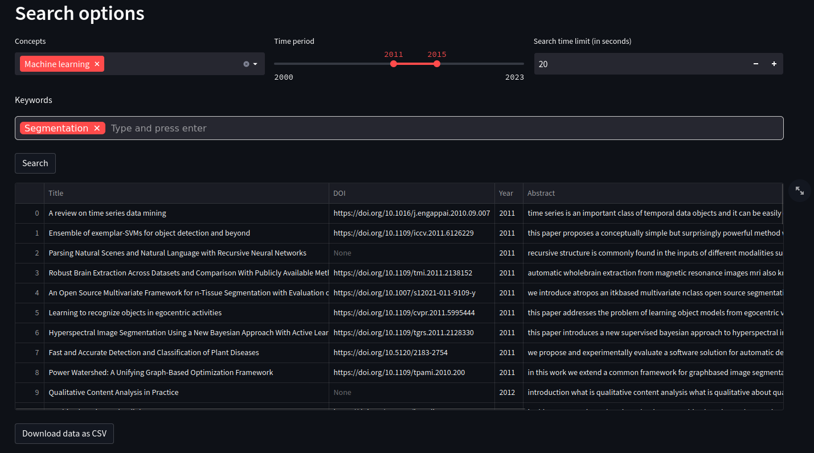

# citation_finder
Query free API to find paper citing another paper

## Main Tools Used
* Front: [Streamlit](https://streamlit.io/) 
* Dataviz: [Plotly](https://plotly.com/python/)
* Back: [FastAPI](https://fastapi.tiangolo.com/)
* References: [OpenAlex](https://openalex.org/),[OpenCitation](opencitations.net/)
## Installation

### Prerequisite:
You'll we need to have docker: 
[See how to install docker here](https://docs.docker.com/get-docker/)

You'll also need docker-compose:
```console
sudo apt install docker-compose
```

### Install and lauch the website:
1. clone the project 
```console
git clone https://github.com/TheoSourget/citation_finder.git
```
2. launch with docker
```console
cd citation_finder
docker compose up -d --build
```
3. To stop the website
```console
docker compose down
```
---

## How to use it ?
You have access to the website at: http://localhost:8501/

### Citation finder
In this section, you can fill the DOI of the paper and choose the source from which we will search for citation of this paper.


Once the information are set click on the search button to compute the citation extraction, it can be long depending on the source and the number of citations. When the extraction is complete the list is displayed as shown below and you can download the result as a CSV file with the button below the list.


You can also see some informations about the citations below the list of citations.


### Keywords research

In this section, you can search for papers using concepts/tags and/or keywords in the abstract. This section only use the OpenAlex API to find the abstract.

First choose the [concepts](https://docs.openalex.org/api-entities/concepts) you want to find, if you select multiple tags papers will have to respect all of them.
You can then select the time period to search for and a Search time limit. Note that the time limit is for a year not the whole selected period.

And finally you can input some keywords to search for in the abstract. If you put multiple keywords, a paper only have to respect one of them to be listed in the results



You'll find in the list the abstract of the paper as well as a link to an open access version of the full text if it exists.
