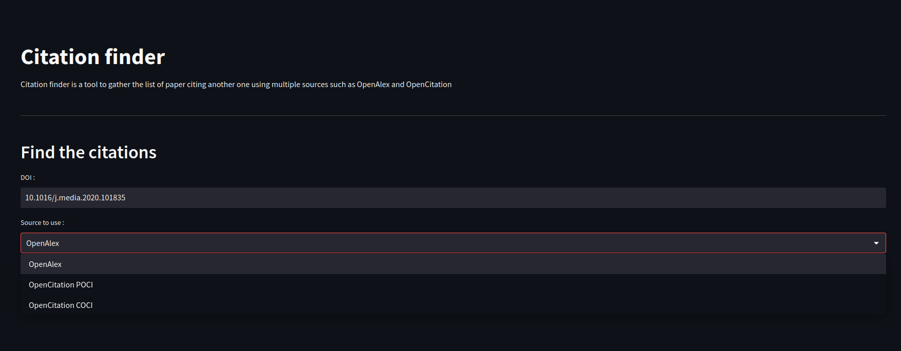
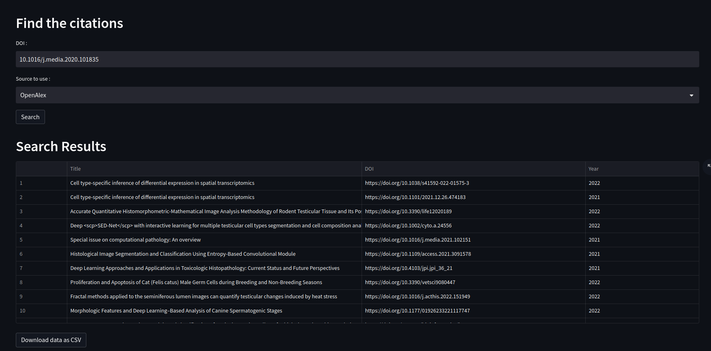
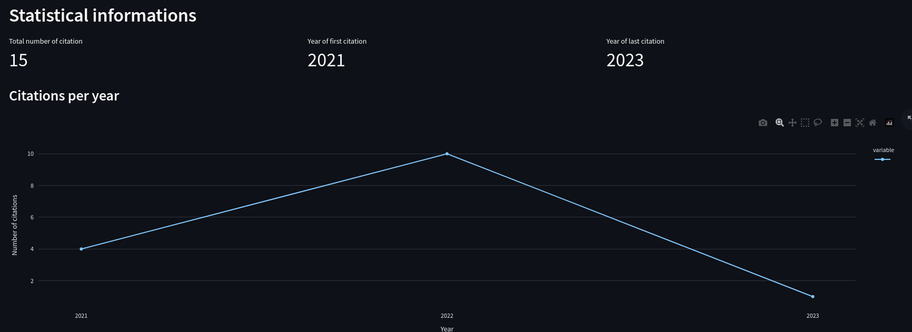

# citation_finder
Query free API to find paper citing another paper

## Main Tools Used
* Front: [Streamlit](https://streamlit.io/) 
* Dataviz: [Plotly](https://plotly.com/python/)
* Back: [FastAPI](https://fastapi.tiangolo.com/)
* References: [OpenAlex](https://openalex.org/),[OpenCitation](opencitations.net/)
## Installation
1. clone the project 
```console
git clone https://github.com/TheoSourget/citation_finder.git
```
2. install requirements
```console
cd citation_finder
pip3 install -r requirements.txt
```

---

## Launch

### For the front:
```console
    cd front
    streamlit run main.py 
```

###
```console
    cd back
    uvicorn main:app --reload
```

## How to use it ?
You have access to the website at: http://localhost:8501/

Then you can fill the DOI of the paper and choose the source from which we will search for citation of this paper.




Once the information are set click on the search button to compute the citation extraction, it can be long depending on the source and the number of citations. When the extraction is complete the list is displayed as shown below and you can download the result as a CSV file with the button below the list.



You can also see some informations about the citations below the list of citations.


